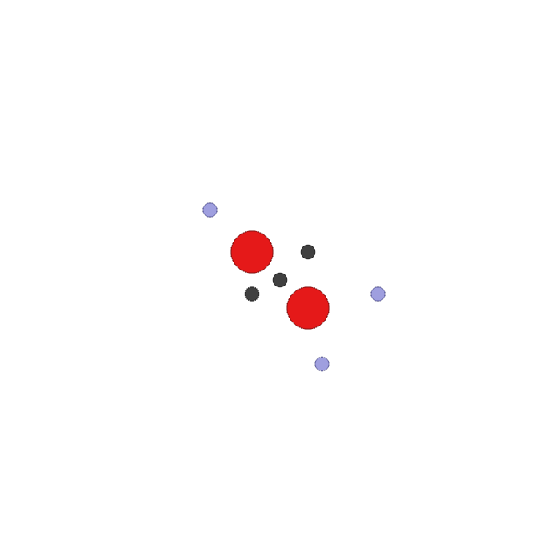
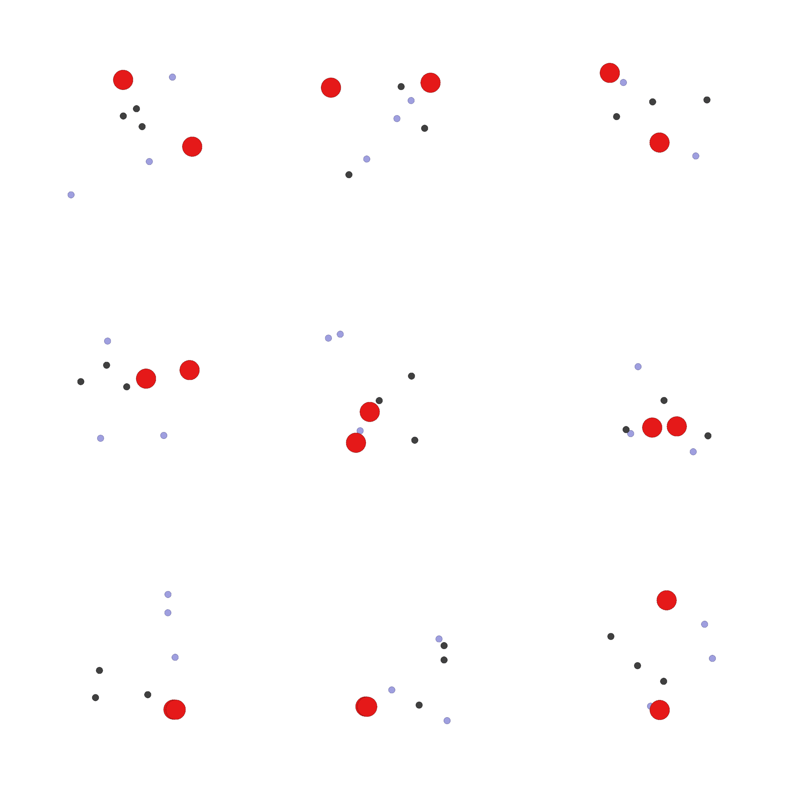

# COMP0124-MAAI-UAV-Collision-Avoidance

## MAPPO (based on [OpenRL](https://github.com/OpenRL-Lab/openrl))

The training and evaluation process of [MAPPO](https://arxiv.org/abs/2103.01955) are implemented in ```openrl``` folder.

To enable the OpenRL library
```
cd openrl
pip install .
```

Our custom MPE for MAPPO algorithm is defined in ```openrl/openrl/envs/mpe/scenarios/simple_spread.py```.

The trained MAPPO model is stored in ```openrl/examples/mpe/ppo_agent``` as .pt file.

To visualize the result of the trained MAPPO in our environment
```
cd openrl/examples/mpe/
python3 test_ppo.py
```

The gif file ```ppo.gif``` recorded the whole environment and actions of agents derived from trained MAPPO model.

When keeping the current setting in ```simple_spread.py```, a fixed environment will be generated as follow
<div align="center">
  </a>
</div>

By changing the initial fixed states in environment to the random sampled case, the result will be
<div align="center">
  </a>
</div>

## QMIX (based on [MARL Benchmark](https://github.com/OpenRL-Lab/openrl))

The training and evaluation process of [QMIX] are implemented in ```off-policy``` folder.

To enable the off-policy library
```
# install off-policy package
cd off-policy
pip install -e .
```
The custom MPE for MAPPO algorithm is defined in ```off-policy/offpolicy/envs/mpe/scenarios/simple_spread.py```. In addition, the test environment based on pettingzoo is also modified.

Main modification includes: 

modifying the QMIX policy optimization and computation (```off-policy/offpolicy/algorithms/qmix/algorithm/QMixPolicy.py```) 

saving the trained model (```off-policy/offpolicy/runner/run/base_runner.py```, ```off-policy/offpolicy/runner/run/mpe_runner.py```), 

saving the actions derived from the last episode (```off-policy/offpolicy/runner/run/base_runner.py```, ```off-policy/offpolicy/runner/run/mpe_runner.py```), 

visualizing on the test environment (```off-policy/offpolicy/envs/mpe/simulation_test.py```, ```off-policy/offpolicy/envs/mpe/result_curves.py```)

The test result is presented in the report.
